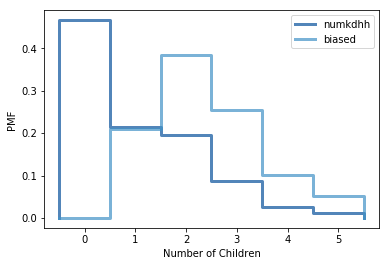

Q2. Think Stats Chapter 3 Exercise 1 (actual vs. biased)
This problem presents a robust example of actual vs biased data. As a data scientist, it will be important to examine not only the data that is available, but also the data that may be missing but highly relevant. You will see how the absence of this relevant data will bias a dataset, its distribution, and ultimately, its statistical interpretation.

***

Exercise 3.1 Something like the class size paradox appears if you survey
children and ask how many children are in their family. Families with many
children are more likely to appear in your sample, and families with no chil-
dren have no chance to be in the sample.
Use the NSFG respondent variable NUMKDHH to construct the actual distribution for the number of children under 18 in the household.
Now compute the biased distribution we would see if we surveyed the children
and asked them how many children under 18 (including themselves) are in
their household.
Plot the actual and biased distributions, and compute their means. As a
starting place, you can use chap03ex.ipynb

***


```python
%matplotlib inline

import numpy as np

import nsfg
import first
import thinkstats2
import thinkplot

resp = nsfg.ReadFemResp()

pmf = thinkstats2.Pmf(resp.numkdhh, label='numkdhh')

thinkplot.Pmf(pmf)
thinkplot.Config(xlabel='Number of Children', ylabel='PMF')
```


```python
def BiasPmf(pmf, label):
    new_pmf = pmf.Copy(label=label)
    for x, p in pmf.Items():
        new_pmf.Mult(x, x)
    new_pmf.Normalize()
    return new_pmf

biased = BiasPmf(pmf, label='biased')

thinkplot.PrePlot(2)
thinkplot.Pmfs([pmf, biased])
thinkplot.Config(xlabel='Number of Children', ylabel='PMF')
```





```python
pmf.Mean()
```


    1.024205155043831


```python
biased.Mean()
```


    2.403679100664282


