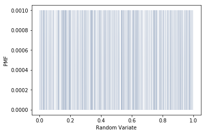
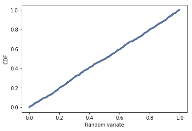

Q3. Think Stats Chapter 4 Exercise 2 (random distribution)
This questions asks you to examine the function that produces random numbers. Is it really random? A good way to test that is to examine the pmf and cdf of the list of random numbers and visualize the distribution. If you're not sure what pmf is, read more about it in Chapter 3.

****

Exercise 4.2 The numbers generated by random.random are supposed to be
uniform between 0 and 1; that is, every value in the range should have the
same probability.
Generate 1000 numbers from random.random and plot their PMF and CDF.
Is the distribution uniform?

****


```python
%matplotlib inline

import numpy as np

import thinkstats2
import thinkplot

rand_num = np.random.random(1000)

pmf = thinkstats2.Pmf(rand_num)
thinkplot.Pmf(pmf, linewidth=0.05)
thinkplot.Config(xlabel='Random Variate', ylabel='PMF')
```





```python
cdf = thinkstats2.Cdf(rand_num)
thinkplot.Cdf(cdf)
thinkplot.Config(xlabel='Random variate', ylabel='CDF')
```





The distribution is uniform, since the CDF is roughly a straight line
